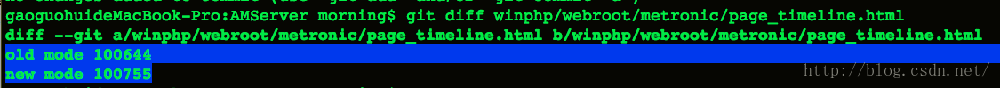
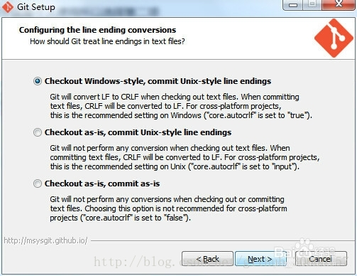

### 问题描述
准备提交代码时，发现很多文件自己没有更改，但是在VS Code中文件的状态显示时M(被修改)
### google的相关问题
[git文件内容没变但status显示不同的解决方案](https://blog.csdn.net/u012109105/article/details/51252242)
[git忽略文件换行/回车符和权限](https://ryzenx.com/2020/06/git-ignore-crlf/)
[Git处理换行符问题](https://blog.csdn.net/github_30605157/article/details/56680990)
[Git 多平台换行符问题(LF or CRLF)](http://kuanghy.github.io/2017/03/19/git-lf-or-crlf)
### 问题分类
**文件权限问题**
    diff文件，显示如下结果:
    ```
    git diff <file name>
    ```
    
    [GIT Diff is saying 100644 → 100755 on many files](https://stackoverflow.com/questions/25672991/git-diff-is-saying-100644-%E2%86%92-100755-on-many-files)
    [git add时create mode 100644到底是什么含义？](https://blog.csdn.net/flyd1005/article/details/43824473)  
    **解决方法**
    ```
    git config --global core.filemode false
    ```

**换行符问题**
    文本文件所使用的换行符，在不同的系统平台上是不一样的，unix下一般只有一个0x0A表示换行(“\n”），Windows下一般都是0x0D和0x0A两个字符(“\r\n”)。  
    安装windows版本的git或者torgoiseGit时，你可能已经进行过这样的配置，也许你当时并未知道那个选项是什么意思。下面这张图是不是有些眼熟呢？
       
    **解决方法**
    在windows执行以下命令:
    ```
    git config --global core.autocrlf false
    ```
    在Linux下执行一下命令:
    ```
    git config --global core.autocrlf false
    git config --global core.safecrlf true
    ```
    ```
    git config --global core.autocrlf input
    ```
    * core.autocrlf设置为input，意思就是检出代码的时候不用转换，提交的时候转换为LF.
    ```
    git config --global core.autocrlf true
    ```
    * core.autocrlf设置为true，就可以在检出代码的时候将LF结尾转换为CRLF，提交的时候转为LF.
    ```
    git config --global core.autocrlf false
    ```
    * core.autocrlf设置为false，就会在windows签出中留下CRLF结尾，但在mac和linux系统以及存储库中会留下LF结尾.

### 换行符提交时更改
git 提交时，由于换行符问题，显示的被修改的文件，需要手动切换LF/CRLF.  
或者可以使用命令替换，需要安装dos  
批量转化
```
find . -type f	xargs dos2unix
```
或者
```
find . -type f -exec dos2unix {} +
```
或者
```
find . -type f -exec dos2unix {} \;
```
### 需要补充的知识
* 学习Linux命令
* git高阶命令